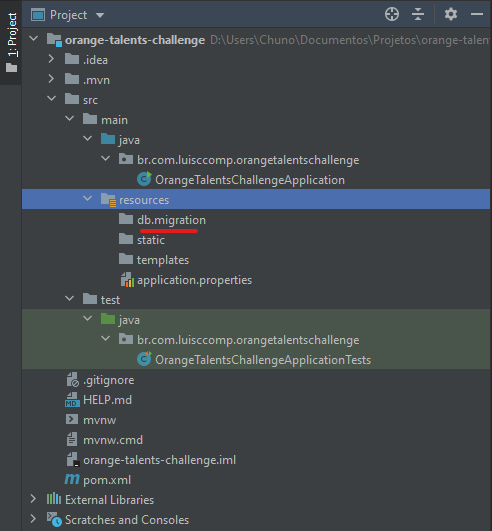
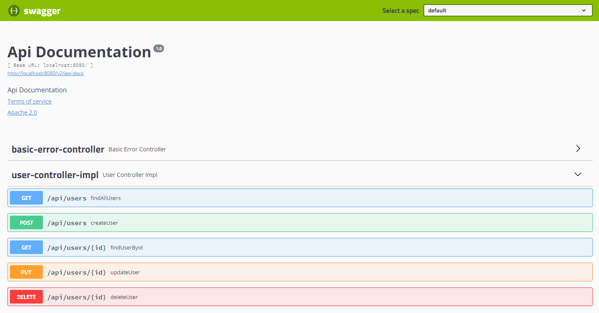

# Implementando um sistema para controle de vacinação

- Author: Luís Carlos Silva Júnior
- Email: luisccomp@gmail.com
- Github: https://github.com/luisccomp


Nessa publicação vou explicar como implementar um sistema de controle de aplicação de vacinas utilizando *Spring* e *Hibernate*, mas **atenção**: esse não será um tutorial de programação, mas sim um texto explicando como implementar um sistema de aplicação de vacinas com Spring, quais tecnologias eu utilizaria para implementar o sistema e algumas dicas de como eu faria. Sem mais delongas, introduzirei a lista de tecnologias do Spring utilizadas no Projeto. Para desenvolver esse projeto estou utilizando Java 14.

Para esse projeto utilizarei as seguintes tecnologias para o seu desenvolvimento (além do Spring + Hibernate):

- Spring Web;
- Spring Boot DevTools;
- Validation;
- Spring Data JPA;
- MySQL Driver (Ou algum outro banco de dados relacional de sua preferência);
- Flyway Migration;

## Spring

O Spring é um framework desenvolvido e mantido (até o momento onde este texto foi escrito) pela **Pivotal**. De forma simplificada, o objetivo do Spring é prover aos desenvolvedores todo um conjunto de ferramentas que auxiliem no desenvolvimento de aplicações Web utilizando Java ou outras linguagens suportadas pelo framework compatíveis com a Máquina Virtual Java (JVM).

## Spring Web

Provê recursos e ferramentas para desenvolvimento de aplicações web MVC e de APIs REST.

## Spring Boot DevTools

O DevTools é uma dependência opcional neste projeto, porém ele oferece recursos bastante úteis no desenvolvimento de aplicações web como, por exemplo, o recurso de *LiveReload* que reinicia a aplicação toda vez que uma mudança é feita em alguma parte do código.

## Validation

Validation é a implementação do Hibernate para as *Bean Validations* do Jakarta EE. *Bean Validations* são espeficações definidas para validações que asseguram que as propriedades de uma classe respeitem algumas restrições. Algumas validações presentes nessa especificação são `@Email` , `@NotNull`, `@NotBlank`, entre outras validações que são citadas na documentação oficial da especificação [1].

## Spring Data JPA

O Spring Data JPA é um projeto dentro da família Spring que facilita o desenvolvimento de repositórios utilizando o JPA (Jakarta Persistence API) [2]. Vale ressaltar que o Spring Data JPA não é uma implementação do JPA, mas sim uma abstração que facilita a criação de repositórios utilizando JPA. O JPA, assim como as *Bean Validations* são um conjunto de especificações que descrevem funcionalidades comuns que devem ser implementadas por frameworks de persistência de dados. As implementações mais conhecidas do JPA são o Hibernate, Apache Open JPA e Eclipse Link.

## MySQL Driver

O driver MySQL é uma biblioteca que permite que nossa aplicação se comunique e se conecte com banco de dados MySQL. Existem específicos para outros bancos de dados relacionais: Postgres, SQL Server, Maria DB, Oracle.

## Flyway Migration

Uma funcionalidade bastante útil do Hibernate, que é bastante utilizada pelos desenvolvedores, é a possibilidade de gerar o banco de dados da aplicação a partir das classes do projeto. Apesar de útil, esse recurso pode ser perigoso se não for bem utilizado. Por outro lado, as vezes é necessário guardar um histórico de todas as alterações feitas no banco de dados durante o processo de desenvolvimento da aplicação. Quais colunas foram adicionadas/removidas de uma tabela, quais foram as novas tabelas criadas, etc. Esse processo de criar um histórico de modificações no banco de dados se chama *Migration*.

# Especificações do projeto

Será desenvolvida uma API REST que precisa controlar a aplicação de vacinas entre a população brasileira. O primeiro passo deve ser a construção de um cadastro de usuários, sendo obrigatórios dados como: nome, e-mail, CPF e data de nascimento, onde e-mail e CPF devem ser únicos. O segundo passo é criar um cadastro de aplicação de vacinas, sendo obrigatórios dados como: nome da vacina, o id do usuário e a data que foi realizada a vacina. Caso os cadastros estejam corretos, é necessário voltar o Status 201, caso hajam erros de preenchimento de dados, o Status deve ser 400. Apenas dois endpoints serão implementados nesse sistema.

# Desenvolvimento

Nessa seção serão abordadas as abordagens que costumo utilizar para o desenvolvimento de projetos Spring e algumas boas práticas.

## Estrutura do projeto

Após a criação de um projeto Spring com Flyway ele vai ter a seguinte estrutura de diretório:



*Figura 1: estrutura inicial do projeto recém criado.*

Todas as migrações do projeto serão incluidas na pasta `db/migration` para que possamos armazenar o histórico de mudanças no banco de dados. As migrações serão armazenadas utilizando a estrutura `V[número da versão]__nome-da-migration.sql`.

## Modelagem de dados

Começarei pela modelagem de dados. Revisitando as especificações do projeto, é possível notar algumas informações bem úteis referentes aos dados do usuário e das vacinas. Baseado na descrição, é possível extrair dali uma forma de representar os dados do problema em forma de tabela em um banco de dados relacional. Abaixo, seria como eu faria a minha tabela e os seus devidos relacionamentos com o usuário. A criação das tabelas foram separadas em dois scripts separados sendo cada um responsável por lidar com suas respectivas tabelas.

```sql
CREATE TABLE users (
    id        BIGINT       NOT NULL AUTO_INCREMENT,
    name      VARCHAR(255) NOT NULL,
    cpf       VARCHAR(11)  NOT NULL UNIQUE,
    email     VARCHAR(255) NOT NULL UNIQUE,
    birthdate DATE         NOT NULL,
    CONSTRAINT users_pk PRIMARY KEY (id)
);

CREATE TABLE vaccines (
	id               BIGINT       NOT NULL AUTO_INCREMENT,
	name             VARCHAR(255) NOT NULL,
    realization_date DATE         NOT NULL,
    user_id          BIGINT       NOT NULL,
    CONSTRAINT vaccines_pk PRIMARY KEY (id),
    CONSTRAINT vaccines_fk_users FOREIGN KEY (user_id) REFERENCES users(id)
);
```

## Implementando as entidades

Vou começar apresentando as entidades do projeto. Conforme o código SQL apresentado anteriormente, decidi implementar as entidades da seguinte forma: uma vacina não pode existir sem um usuário, o que indica que a vacina é uma entidade fraca no nosso relacionamento. As entidades serão anotadas com uma anotação chamada `@Entity` para indicar que a classe em questão é uma entidade do banco, uma anotação `@Table` para indicar a tabela que ela se refere e seus atributos com `@Column` para mapeá-los para suas respectivas colunas. A estratégia `IDENTITY` apenas informa ao SGBD que a chave primaria é uma coluna `auto_increment`. Vale lembrar  que nem todos os bancos de dados podem suportar essa opção. A chave primária é anotada com `@Id` e seu valor é incrementado automáticamente, conforme a estratégia de geração atribuída a ela. A partir do código SQL, as classes que representaram essas entidades respectivamente são:

Implementação da entidade Usuário:

```java
package br.com.luisccomp.orangetalentschallenge.domain.model.entity;

// ... imports ...

@Entity
@Table(name = "users")
public class User {

    @Id
    @GeneratedValue(strategy = GenerationType.IDENTITY)
    @Column(name = "id", nullable = false)
    private Long id;

    @Column(name = "name", nullable = false)
    private String name;

    @Column(name = "cpf", nullable = false, unique = true, length = 11)
    private String cpf;

    @Column(name = "email", nullable = false, unique = true)
    private String email;

    @Column(name = "birthdate")
    private LocalDate birthdate;

    @OneToMany(cascade = CascadeType.ALL, fetch = FetchType.LAZY)
    @JoinColumn(name = "user_id")
    private List<Vaccine> vaccines;

    public User() {

    }

    public User(Long id, String name, String cpf, String email, LocalDate birthdate) {
        this.id = id;
        this.name = name;
        this.cpf = cpf;
        this.email = email;
        this.birthdate = birthdate;
    }
    
    // ... getters e setters ...
    
    @Override
    public boolean equals(Object o) {
        if (this == o) return true;
        if (o == null || getClass() != o.getClass()) return false;
        User user = (User) o;
        return Objects.equals(id, user.id);
    }

    @Override
    public int hashCode() {
        return Objects.hash(id);
    }
}
```

Implementação da entidade Vacina:

```java
package br.com.luisccomp.orangetalentschallenge.domain.model.entity;

// ... imports ...

@Entity
@Table(name = "vaccines")
public class Vaccine {
    @Id
    @GeneratedValue(strategy = GenerationType.IDENTITY)
    @Column(name = "id", nullable = false)
    private Long id;

    @Column(name = "name", nullable = false)
    private String name;

    @Column(name = "realization_date", nullable = false)
    private LocalDate realizationDate;

    @ManyToOne(cascade = CascadeType.ALL, fetch = FetchType.LAZY)
    private User user;

    public Vaccine() {

    }

    public Vaccine(Long id, String name, LocalDate realizationDate, User user) {
        this.id = id;
        this.name = name;
        this.realizationDate = realizationDate;
        this.user = user;
    }

    // ... getters e setters ...

    @Override
    public boolean equals(Object o) {
        if (this == o) return true;
        if (o == null || getClass() != o.getClass()) return false;
        Vaccine vaccine = (Vaccine) o;
        return Objects.equals(id, vaccine.id);
    }

    @Override
    public int hashCode() {
        return Objects.hash(id);
    }
}
```

## *Exceptions* e *Exception Handler*

Durante o funcionamento da aplicação, comportamentos inesperados podem ocorrer como, por exemplo, envio de dados inválidos para um determinado campo na hora do cadastro de usuário ou vacina. As exceptions criadas para lidar com esses erros foram implementadas a partir de uma classe Base conforme indicado no código a seguir:

```java
package br.com.luisccomp.orangetalentschallenge.exception;

import org.springframework.http.HttpStatus;

public abstract class BaseHttpException extends RuntimeException {

    private final HttpStatus status;
    private final Object details;

    public BaseHttpException(String message, HttpStatus status, Object details) {
        super(message);
        this.status = status;
        this.details = details;
    }

    public HttpStatus getStatus() {
        return status;
    }

    public Object getDetails() {
        return details;
    }

}
```

Sempre que a requisição possuir algum dado inválido, essa exceção será lançada:

```java
package br.com.luisccomp.orangetalentschallenge.exception;

import org.springframework.http.HttpStatus;

public class BadRequestException extends BaseHttpException {

    public BadRequestException(String message, Object details) {
        super(message, HttpStatus.BAD_REQUEST, details);
    }

    public BadRequestException(String message) {
        super(message, HttpStatus.BAD_REQUEST, null);
    }

}
```

E sempre que um determinado recurso que o usuário deseja buscar não existir, essa exceção será lançada:

```java
package br.com.luisccomp.orangetalentschallenge.exception;

import org.springframework.http.HttpStatus;
import org.springframework.web.bind.annotation.ResponseStatus;

@ResponseStatus(HttpStatus.NOT_FOUND)
public class NotFoundException extends BaseHttpException {

    public NotFoundException(String message, Object details) {
        super(message, HttpStatus.NOT_FOUND, details);
    }

    public NotFoundException(String message) {
        super(message, HttpStatus.NOT_FOUND, null);
    }

}
```

Também foi criada uma classe para representar uma mensagem de erro, caso ocorra um comportamento inesperado. Essa classe possui somente a informação essencial para o usuário que está consumindo a API.

```Java
package br.com.luisccomp.orangetalentschallenge.domain.model.response;

import com.fasterxml.jackson.annotation.JsonProperty;
import com.fasterxml.jackson.annotation.JsonPropertyOrder;

@JsonPropertyOrder({"status", "message", "details"})
public class ErrorResponse {

    @JsonProperty("status")
    private Integer status;

    @JsonProperty("message")
    private String message;

    @JsonProperty("details")
    private Object details;

    public ErrorResponse() {

    }
    
    public ErrorResponse(Integer status, String message, Object details) {
        this.status = status;
        this.message = message;
        this.details = details;
    }

    @JsonPropertyOrder({"field", "error"})
    public static class FieldErrorDetails {
        @JsonProperty("field")
        private String field;

        @JsonProperty("error")
        private String error;

        public FieldErrorDetails() {

        }

        public FieldErrorDetails(String field, String error) {
            this.field = field;
            this.error = error;
        }

        // ... getters e setters ...
    }

    // ... getters e setters ...

}
```

Por fim, uma classe anotada como `@RestControllerAdvice`, tornando-a elegível para captura e tratamento de exceptions geradas durante o tempo de execução da aplicação:

```java
package br.com.luisccomp.orangetalentschallenge.exception;

import br.com.luisccomp.orangetalentschallenge.domain.model.response.ErrorResponse;
import java.util.stream.Collectors;
import org.springframework.http.HttpHeaders;
import org.springframework.http.HttpStatus;
import org.springframework.http.ResponseEntity;
import org.springframework.validation.FieldError;
import org.springframework.web.bind.MethodArgumentNotValidException;
import org.springframework.web.bind.annotation.ExceptionHandler;
import org.springframework.web.bind.annotation.RestControllerAdvice;
import org.springframework.web.context.request.WebRequest;
import org.springframework.web.servlet.mvc.method.annotation.ResponseEntityExceptionHandler;

@RestControllerAdvice
public class GlobalExceptionHandler extends ResponseEntityExceptionHandler {

    @ExceptionHandler(BaseHttpException.class)
    public ResponseEntity<Object> handleBaseHttpException(BaseHttpException ex, WebRequest request) {
        var response = new ErrorResponse(ex.getStatus().value(), ex.getMessage(), ex.getDetails());

        return handleExceptionInternal(ex, response, new HttpHeaders(), ex.getStatus(), request);
    }

    @Override
    protected ResponseEntity<Object> handleMethodArgumentNotValid(MethodArgumentNotValidException ex,
                                                                  HttpHeaders headers,
                                                                  HttpStatus status,
                                                                  WebRequest request) {
        var details = ex.getBindingResult()
                .getAllErrors()
                .stream()
                .map(error -> new ErrorResponse.FieldErrorDetails(((FieldError) error).getField(), error.getDefaultMessage()))
                .collect(Collectors.toList());

        var response = new ErrorResponse(status.value(), "Validation failed for one or more fields", details);

        return handleExceptionInternal(ex, response, headers, status, request);
    }

}
```

## Configurações e mapeamento de classes com ObjectMapper

Como o Spring Framework é um Framework construindo em cima dos princípios de inversão de cotrole (IoC) e injeção de dependências, as vezes precisamos informar ao Framework que desejamos que um determinada instância de uma classe seja passível de ser injetado onde são requeridos. Aqui vou criar uma classe de configuração para o pacote Jackson onde eu retorno uma instância customizada de um objeto ObjectMapper configurada para as necessidades do projeto:

```java
package br.com.luisccomp.orangetalentschallenge.core.configuration;

import com.fasterxml.jackson.databind.DeserializationFeature;
import com.fasterxml.jackson.databind.ObjectMapper;
import com.fasterxml.jackson.databind.SerializationFeature;
import com.fasterxml.jackson.datatype.jsr310.JavaTimeModule;
import org.springframework.context.annotation.Bean;
import org.springframework.context.annotation.Configuration;

@Configuration
public class JacksonConfiguration {

    @Bean
    public ObjectMapper objectMapper() {
        return new ObjectMapper()
                // PROPRIEDADES NÃO MAPEADAS não quebram
                .configure(DeserializationFeature.FAIL_ON_UNKNOWN_PROPERTIES, false)
                // NÃO FALHA SE ALGUMA PROPRIEDADE ESTIVER VAZIA
                .configure(SerializationFeature.FAIL_ON_EMPTY_BEANS, false)
                // SERVE Para compatibilidade de arrays, quando tem um array com um item, caso não tenha, essa config
                // se perde.
                .enable(DeserializationFeature.ACCEPT_SINGLE_VALUE_AS_ARRAY)
                // Determina se datas devem ser mapeadas para timestamps em formato array numérico (true) ou se devem
                // ser convertidas para texto (false)
                .configure(SerializationFeature.WRITE_DATES_AS_TIMESTAMPS, false)
                // Serializa datas
                .registerModule(new JavaTimeModule());
    }

}
```

Criado a classe de configuração, hora de criar um componente para mapeamento de objetos. O objetivo desse componente (que também será elegível para injeção de dependência) é reduzir a quantidade de getters e setters no código, deixando a invocação dos mesmos apenas quando necessário. Por questões de boas práticas, farei uso de interfaces para evitar o acoplamento do código com uma instância em específico, tornando possível a troca da classe de mapeamento. Com poucas alterações, é possível utilizar outras bibliotecas, como ModelMapper, por exemplo.

```java
package br.com.luisccomp.orangetalentschallenge.core.mapper;

public interface ClassMapper {

    <T, U> U map(T object, Class<U> target);

}

```

```java
package br.com.luisccomp.orangetalentschallenge.core.mapper;

import com.fasterxml.jackson.databind.ObjectMapper;
import org.springframework.beans.factory.annotation.Autowired;
import org.springframework.stereotype.Component;

@Component
public class ObjectMapperClassMapper implements ValueMapper {

    private final ObjectMapper objectMapper;

    @Autowired
    public ObjectMapperClassMapper(ObjectMapper objectMapper) {
        this.objectMapper = objectMapper;
    }

    @Override
    public <T, U> U map(T object, Class<U> target) {
        return objectMapper.convertValue(object, target);
    }

}
```

## Implementando o *endpoint* de usuários

Os passos para a implementação do endpoint de usuários será feito da seguinte forma: repositório, serviços e controller. Não vou lidar diretamente com as classe, mas sim com classes cujo propósito é guardar dados (DTOs, VO ou ViewModel). As classes responsáveis por armazenar os dados de requisição e resposta dos usuários erão `UserRequestDTO` e `UserResponseDTO`.

Nessa classe faço uso dos validators. Eles servem para validar se as propriedades da requisição são válidos antes de serem passados adiante pela *controller*.

```java
package br.com.luisccomp.orangetalentschallenge.domain.model.request;

import com.fasterxml.jackson.annotation.JsonProperty;
import java.time.LocalDate;
import javax.persistence.Temporal;
import javax.persistence.TemporalType;
import javax.validation.constraints.Email;
import javax.validation.constraints.NotBlank;
import javax.validation.constraints.NotEmpty;
import javax.validation.constraints.NotNull;
import org.hibernate.validator.constraints.br.CPF;
import org.springframework.format.annotation.DateTimeFormat;

public class UserRequestDTO {

    @JsonProperty("name")
    @NotBlank
    private String name;

    @JsonProperty("cpf")
    @CPF
    private String cpf;

    @JsonProperty("email")
    @NotEmpty
    @Email
    private String email;

    @JsonProperty("birthdate")
    @Temporal(TemporalType.DATE)
    @DateTimeFormat(pattern = "yyyy-MM-dd")
    @NotNull
    private LocalDate birthdate;

    public UserRequestDTO() {

    }

    public UserRequestDTO(String name, String cpf, String email, LocalDate birthdate) {
        this.name = name;
        this.cpf = cpf;
        this.email = email;
        this.birthdate = birthdate;
    }

    // ... getters e setters ...

}

```

A classe de Resposta apenas cotém as informações que serão retornadas para quem está consumindo a API:

```java
package br.com.luisccomp.orangetalentschallenge.domain.model.response;

import com.fasterxml.jackson.annotation.JsonProperty;
import com.fasterxml.jackson.annotation.JsonPropertyOrder;
import java.time.LocalDate;
import org.springframework.format.annotation.DateTimeFormat;

@JsonPropertyOrder({"id", "name", "cpf", "email", "birthdate"})
public class UserResponseDTO {

    @JsonProperty("id")
    private Long id;

    @JsonProperty("name")
    private String name;

    @JsonProperty("cpf")
    private String cpf;

    @JsonProperty("email")
    private String email;

    @JsonProperty("birthdate")
    @DateTimeFormat(pattern = "yyyy-MM-dd")
    private LocalDate birthdate;

    public UserResponseDTO() {

    }

    public UserResponseDTO(Long id, String name, String cpf, String email, LocalDate birthdate) {
        this.id = id;
        this.name = name;
        this.cpf = cpf;
        this.email = email;
        this.birthdate = birthdate;
    }

    // ... getters e setters ...
}

```

### O repositório de usuários

O repositório de usuário contém, além das operações básicas, dois query methods para verificar se existe um usuário com o email ou cpf informados. O repositório também implementa outra interface chamada `JpaSpecificationExecutor`, que torna possível executar queries com base em `Specifications` . Isso torna possível a criação de buscas mais dinâmicas.

```java
package br.com.luisccomp.orangetalentschallenge.domain.repository;

import br.com.luisccomp.orangetalentschallenge.domain.model.entity.User;
import org.springframework.data.jpa.repository.JpaRepository;
import org.springframework.data.jpa.repository.JpaSpecificationExecutor;
import org.springframework.stereotype.Repository;

@Repository
public interface UserRepository extends JpaRepository<User, Long>, JpaSpecificationExecutor<User> {

    boolean existsByCpf(String cpf);

    boolean existsByEmail(String email);

}

```

Após a criação do repositório, é necessário também definir as `Specifications` das buscas por usuário no banco de dados. Levando em consideração que as buscas mais comuns são as de intervalo entre datas, a classe das especificações do usuário será implementada da seguinte forma:

```java
package br.com.luisccomp.orangetalentschallenge.domain.repository.specifications;

import br.com.luisccomp.orangetalentschallenge.domain.model.entity.User;
import java.time.LocalDate;
import org.springframework.data.jpa.domain.Specification;

public class UserSpecifications {

    public static Specification<User> fromBirthdate(LocalDate birthdate) {
        if (birthdate != null) {
            return (user, query, builder) -> builder.greaterThanOrEqualTo(user.get("birthdate"), birthdate);
        } else {
            return null;
        }
    }

    public static Specification<User> toBirthdate(LocalDate birthdate) {
        if (birthdate != null) {
            return (user, query, builder) -> builder.lessThanOrEqualTo(user.get("birthdate"), birthdate);
        } else {
            return null;
        }
    }

}
```

### Serviço de usuários

A classe de serviços é a parte que lida diretamente com o repositório. Também, por questões de boas práticas, o ideal é depender somente de sua interface em vez de implementações:

```java
package br.com.luisccomp.orangetalentschallenge.service;

import br.com.luisccomp.orangetalentschallenge.domain.model.entity.User;
import br.com.luisccomp.orangetalentschallenge.domain.model.request.UserRequestDTO;
import br.com.luisccomp.orangetalentschallenge.domain.model.response.UserResponseDTO;
import java.time.LocalDate;
import org.springframework.data.domain.Page;
import org.springframework.data.domain.Pageable;

public interface UserService {

    UserResponseDTO createUser(UserRequestDTO userCreateRequest);

    Page<UserResponseDTO> findAllUsers(LocalDate fromDate, LocalDate toDate, Pageable pageable);

    UserResponseDTO findUserById(Long id);

    UserResponseDTO updateUser(Long id, UserRequestDTO userUpdateRequest);

    void deleteUser(Long id);

    User getUserById(Long id);

}
```

Note que, tanto na interface quanto na implementação, o método "findAllUsers" possui outros parâmetros além do `pageable`. Com o as `Specifications` do JPA, é possível construir queries de forma dinâmica durante a execução da aplicação. Se esses parâmetros de busca não forem informados (possuem o valor null atribuído a eles), eles não serão considerados na hora de realizar uma busca no banco.

```java
package br.com.luisccomp.orangetalentschallenge.service.impl;

import br.com.luisccomp.orangetalentschallenge.core.mapper.ValueMapper;
import br.com.luisccomp.orangetalentschallenge.domain.model.entity.User;
import br.com.luisccomp.orangetalentschallenge.domain.model.request.UserRequestDTO;
import br.com.luisccomp.orangetalentschallenge.domain.model.response.UserResponseDTO;
import br.com.luisccomp.orangetalentschallenge.domain.repository.UserRepository;
import br.com.luisccomp.orangetalentschallenge.exception.BadRequestException;
import br.com.luisccomp.orangetalentschallenge.exception.NotFoundException;
import br.com.luisccomp.orangetalentschallenge.service.UserService;
import java.time.LocalDate;
import org.springframework.beans.factory.annotation.Autowired;
import org.springframework.data.domain.Page;
import org.springframework.data.domain.Pageable;
import org.springframework.stereotype.Service;

import static br.com.luisccomp.orangetalentschallenge.domain.repository.specifications.UserSpecifications.fromBirthdate;
import static br.com.luisccomp.orangetalentschallenge.domain.repository.specifications.UserSpecifications.toBirthdate;
import static org.springframework.data.jpa.domain.Specification.where;

@Service
public class UserServiceImpl implements UserService {

    private final UserRepository userRepository;
    private final ValueMapper valueMapper;

    @Autowired
    public UserServiceImpl(UserRepository userRepository, ValueMapper valueMapper) {
        this.userRepository = userRepository;
        this.valueMapper = valueMapper;
    }

    @Override
    public UserResponseDTO createUser(UserRequestDTO userCreateRequest) {
        if (userRepository.existsByCpf(userCreateRequest.getCpf()) ||
                userRepository.existsByEmail(userCreateRequest.getEmail()))
            throw new BadRequestException("User email or CPF must be unique");

        var user = valueMapper.map(userCreateRequest, User.class);

        return valueMapper.map(userRepository.save(user), UserResponseDTO.class);
    }

    @Override
    public Page<UserResponseDTO> findAllUsers(LocalDate fromDate, LocalDate toDate, Pageable pageable) {
        return userRepository.findAll(
                where(fromBirthdate(fromDate))
                        .and(where(toBirthdate(toDate))),
                pageable
        ).map(user -> valueMapper.map(user, UserResponseDTO.class));
    }

    @Override
    public UserResponseDTO findUserById(Long id) {
        var user = userRepository.findById(id)
                .orElseThrow(() -> new NotFoundException("User not found"));

        return valueMapper.map(user, UserResponseDTO.class);
    }

    @Override
    public UserResponseDTO updateUser(Long id, UserRequestDTO userUpdateRequest) {
        var user = userRepository.findById(id)
                .orElseThrow(() -> new NotFoundException("User not found"));

        if (!user.getCpf().equals(userUpdateRequest.getCpf()) && userRepository.existsByCpf(userUpdateRequest.getCpf()) ||
                !user.getEmail().equals(userUpdateRequest.getEmail()) && userRepository.existsByCpf(userUpdateRequest.getCpf()))
            throw new BadRequestException("User email or CPF must be unique");

        user.setName(user.getName());
        user.setCpf(user.getCpf());
        user.setEmail(user.getEmail());
        user.setBirthdate(user.getBirthdate());

        return valueMapper.map(userRepository.save(user), UserResponseDTO.class);
    }

    @Override
    public void deleteUser(Long id) {
        var user = userRepository.findById(id)
                .orElseThrow(() -> new NotFoundException("User not found"));

        userRepository.delete(user);
    }

    @Override
    public User getUserById(Long id) {
        return userRepository.findById(id)
                .orElseThrow(() -> new NotFoundException("User not found"));
    }

}

```

### Controller de usuários

Para a controller de usuários, fiz uso de interfaces por questões de legibilidade. Quero evitar o uso de muitas annotations em sua implementação, deixando-as na interface. A interface contém as annotations responsáveis pela validação, mapeamento de dados e as rotas com seus respectivos métodos HTTP. A anotação `@RequestBody` serve para mapear o conteúdo do corpo da requisição para o parâmetro dentro da action da controller, já o `@Valid` verifica se os campos são válidos. Já a `@PathVariable`  faz o binding de uma variável do caminho da url para um parâmetro (de mesmo nome) do método.

Assim, a interface da controller ficaria assim:

```java
package br.com.luisccomp.orangetalentschallenge.controller;

import br.com.luisccomp.orangetalentschallenge.domain.model.request.UserRequestDTO;
import br.com.luisccomp.orangetalentschallenge.domain.model.response.UserResponseDTO;
import java.time.LocalDate;
import javax.validation.Valid;
import org.springframework.data.domain.Page;
import org.springframework.data.domain.Pageable;
import org.springframework.format.annotation.DateTimeFormat;
import org.springframework.http.ResponseEntity;
import org.springframework.web.bind.annotation.DeleteMapping;
import org.springframework.web.bind.annotation.GetMapping;
import org.springframework.web.bind.annotation.PathVariable;
import org.springframework.web.bind.annotation.PostMapping;
import org.springframework.web.bind.annotation.PutMapping;
import org.springframework.web.bind.annotation.RequestBody;
import org.springframework.web.bind.annotation.RequestMapping;
import org.springframework.web.bind.annotation.RequestParam;

@RequestMapping("/api/users")
public interface UserController {

    @PostMapping
    ResponseEntity<UserResponseDTO> createUser(@RequestBody @Valid UserRequestDTO userCreateRequest);

    @GetMapping
    ResponseEntity<Page<UserResponseDTO>> findAllUsers(
            @RequestParam(required = false) @DateTimeFormat(pattern = "yyyy-MM-dd") LocalDate fromDate,
            @RequestParam(required = false) @DateTimeFormat(pattern = "yyyy-MM-dd") LocalDate toDate,
            Pageable pageable
    );

    @GetMapping("/{id}")
    ResponseEntity<UserResponseDTO> findUserById(@PathVariable Long id);

    @PutMapping("/{id}")
    ResponseEntity<UserResponseDTO> updateUser(@PathVariable Long id, @RequestBody @Valid UserRequestDTO userUpdateRequest);

    @DeleteMapping("/{id}")
    ResponseEntity<?> deleteUser(@PathVariable Long id);

}

```

Conforme o código da interface, como nem sempre os intervalos de data serão informados, os parâmetros fromDate e toDate são opcionais (not required).

E a controller seria implementada dessa forma:

```java
package br.com.luisccomp.orangetalentschallenge.controller.impl;

import br.com.luisccomp.orangetalentschallenge.controller.UserController;
import br.com.luisccomp.orangetalentschallenge.domain.model.request.UserRequestDTO;
import br.com.luisccomp.orangetalentschallenge.domain.model.response.UserResponseDTO;
import br.com.luisccomp.orangetalentschallenge.service.UserService;
import java.net.URI;
import java.time.LocalDate;
import javax.validation.Valid;
import org.springframework.beans.factory.annotation.Autowired;
import org.springframework.data.domain.Page;
import org.springframework.data.domain.Pageable;
import org.springframework.http.ResponseEntity;
import org.springframework.web.bind.annotation.RestController;

@RestController
public class UserControllerImpl implements UserController {

    private final UserService userService;

    @Autowired
    public UserControllerImpl(UserService userService) {
        this.userService = userService;
    }

    @Override
    public ResponseEntity<UserResponseDTO> createUser(@Valid UserRequestDTO userCreateRequest) {
        var response = userService.createUser(userCreateRequest);

        var uri = URI.create("/api/users/" + response.getId());

        return ResponseEntity.created(uri)
                .body(response);
    }

    @Override
    public ResponseEntity<Page<UserResponseDTO>> findAllUsers(LocalDate fromDate, LocalDate toDate, Pageable pageable) {
        return ResponseEntity.ok(userService.findAllUsers(fromDate, toDate, pageable));
    }

    @Override
    public ResponseEntity<UserResponseDTO> findUserById(Long id) {
        return ResponseEntity.ok(userService.findUserById(id));
    }

    @Override
    public ResponseEntity<UserResponseDTO> updateUser(Long id, @Valid UserRequestDTO userUpdateRequest) {
        return ResponseEntity.ok(userService.updateUser(id, userUpdateRequest));
    }

    @Override
    public ResponseEntity<?> deleteUser(Long id) {
        userService.deleteUser(id);

        return ResponseEntity.noContent()
                .build();
    }

}
```

## Implementando o *endpoint* de Vacinas

De forma semelhante aos usuários, para as vacinas crio algumas classes cuja única responsabilidade é apenas conter dados. Ao contrário dos usuários, nem todos os campos da vacina serão atualizados, assim a requisição para atualizar e criar uma vacina não serão instâncias da mesma classe. Sendo assim, a classe que representa uma requisição para criação de uma vacina é:

```java
package br.com.luisccomp.orangetalentschallenge.domain.model.request;

import com.fasterxml.jackson.annotation.JsonProperty;
import java.time.LocalDate;
import javax.persistence.Temporal;
import javax.persistence.TemporalType;
import javax.validation.constraints.NotBlank;
import javax.validation.constraints.NotNull;
import org.springframework.format.annotation.DateTimeFormat;

public class VaccineCreateRequestDTO {

    @JsonProperty("name")
    @NotBlank
    private String name;

    @JsonProperty("realizationDate")
    @NotNull
    @Temporal(TemporalType.DATE)
    @DateTimeFormat(pattern = "yyyy-MM-dd")
    private LocalDate realizationDate;

    @JsonProperty("userId")
    @NotNull
    private Long userId;

    public VaccineCreateRequestDTO() {

    }

    public VaccineCreateRequestDTO(@NotBlank String name, @NotNull LocalDate realizationDate) {
        this.name = name;
        this.realizationDate = realizationDate;
    }
    
    // ... getters e setters ...
}
```

A classe que representa uma requisição de atualização é:

```java
package br.com.luisccomp.orangetalentschallenge.domain.model.request;

import com.fasterxml.jackson.annotation.JsonProperty;
import java.time.LocalDate;
import javax.persistence.Temporal;
import javax.persistence.TemporalType;
import javax.validation.constraints.NotBlank;
import javax.validation.constraints.NotNull;
import org.springframework.format.annotation.DateTimeFormat;

public class VaccineUpdateRequestDTO {

    @JsonProperty("name")
    @NotBlank
    private String name;

    @JsonProperty("realizationDate")
    @NotNull
    @Temporal(TemporalType.DATE)
    @DateTimeFormat(pattern = "yyyy-MM-dd")
    private LocalDate realizationDate;

    public VaccineUpdateRequestDTO() {

    }

    public VaccineUpdateRequestDTO(@NotBlank String name, @NotNull LocalDate realizationDate) {
        this.name = name;
        this.realizationDate = realizationDate;
    }
    
    // ... getters e setters ...
}
```

E a resposta apresentada ao usuário tem a seguinte forma:

```java
package br.com.luisccomp.orangetalentschallenge.domain.model.response;

import com.fasterxml.jackson.annotation.JsonProperty;
import com.fasterxml.jackson.annotation.JsonPropertyOrder;
import java.time.LocalDate;

@JsonPropertyOrder({"id", "name", "realizationDate", "user"})
public class VaccineResponseDTO {

    @JsonProperty("id")
    private Long id;

    @JsonProperty("name")
    private String name;

    @JsonProperty("realizationDate")
    private LocalDate realizationDate;

    @JsonProperty("user")
    private UserResponseDTO user;

    public VaccineResponseDTO() {

    }

    public VaccineResponseDTO(Long id, String name, LocalDate realizationDate, UserResponseDTO user) {
        this.id = id;
        this.name = name;
        this.realizationDate = realizationDate;
        this.user = user;
    }

	// ... getters e setters ...
    
}

```

### O repositório de vacinas

Da mesma forma que repositório do usuário, o repositório de vacinas implementa mais de uma interface: a interface `JpaRepository` e `JpaSpecificationExecutor`. Dessa forma será possível criar consultas no banco de dados de forma mais dinâmica com o Spring Data JPA.

```java
package br.com.luisccomp.orangetalentschallenge.domain.repository;

import br.com.luisccomp.orangetalentschallenge.domain.model.entity.Vaccine;
import org.springframework.data.domain.Page;
import org.springframework.data.domain.Pageable;
import org.springframework.data.jpa.repository.JpaRepository;
import org.springframework.data.jpa.repository.JpaSpecificationExecutor;
import org.springframework.data.jpa.repository.Query;
import org.springframework.data.repository.query.Param;
import org.springframework.stereotype.Repository;

@Repository
public interface VaccineRepository extends JpaRepository<Vaccine, Long>, JpaSpecificationExecutor<Vaccine> {

}

```

Criado o repositório, vamos as especificações. Dado que as consultas mais comuns de vacinas serão por cpf e por nome, então a classe de especificações será implementada da seguinte forma:

```java
package br.com.luisccomp.orangetalentschallenge.domain.repository.specifications;

import br.com.luisccomp.orangetalentschallenge.domain.model.entity.Vaccine;
import org.springframework.data.jpa.domain.Specification;

public class VaccineSpecifications {

    public static Specification<Vaccine> hasUserWithCpf(String cpf) {
        if (cpf != null) {
            return (vaccine, query, builder) -> builder.equal(vaccine.get("user").get("cpf"), cpf);
        } else {
            return  null;
        }
    }

    public static Specification<Vaccine> hasNameLike(String name) {
        if (name != null) {
        	return (vaccine, query, builder) -> builder.like(vaccine.get("name"), "%" + name + "%");
        } else {
            return null;
        }
    }

}
```


### Serviço de vacinas

De forma semelhante ao serviço de usuários, aqui também farei uso de interfaces por questões de boas práticas e para evitar o acoplamento com uma classe em específico.

```java
package br.com.luisccomp.orangetalentschallenge.service;

import br.com.luisccomp.orangetalentschallenge.domain.model.request.VaccineCreateRequestDTO;
import br.com.luisccomp.orangetalentschallenge.domain.model.request.VaccineUpdateRequestDTO;
import br.com.luisccomp.orangetalentschallenge.domain.model.response.VaccineResponseDTO;
import org.springframework.data.domain.Page;
import org.springframework.data.domain.Pageable;

public interface VaccineService {
    VaccineResponseDTO createVaccine(VaccineCreateRequestDTO vaccineCreateRequest);

    Page<VaccineResponseDTO> findAllVaccines(String cpf, String name, Pageable pageable);

    VaccineResponseDTO findVaccineById(Long id);

    VaccineResponseDTO updateVaccine(Long id, VaccineUpdateRequestDTO vaccineUpdateRequest);

    void deleteVaccine(Long id);
}
```

Note que, tanto na interface quanto na implementação, o método "findAllVaccines" possui outros parâmetros além do `pageable`. Com o as `Specifications` do JPA, é possível construir queries de forma dinâmica durante a execução da aplicação. Se esses parâmetros de busca não forem informados, eles não serão considerados na busca no banco.

```java
package br.com.luisccomp.orangetalentschallenge.service.impl;

import br.com.luisccomp.orangetalentschallenge.core.mapper.ValueMapper;
import br.com.luisccomp.orangetalentschallenge.domain.model.entity.Vaccine;
import br.com.luisccomp.orangetalentschallenge.domain.model.request.VaccineCreateRequestDTO;
import br.com.luisccomp.orangetalentschallenge.domain.model.request.VaccineUpdateRequestDTO;
import br.com.luisccomp.orangetalentschallenge.domain.model.response.VaccineResponseDTO;
import br.com.luisccomp.orangetalentschallenge.domain.repository.VaccineRepository;
import br.com.luisccomp.orangetalentschallenge.exception.NotFoundException;
import br.com.luisccomp.orangetalentschallenge.service.UserService;
import br.com.luisccomp.orangetalentschallenge.service.VaccineService;
import org.springframework.beans.factory.annotation.Autowired;
import org.springframework.data.domain.Page;
import org.springframework.data.domain.Pageable;
import org.springframework.stereotype.Service;

import static br.com.luisccomp.orangetalentschallenge.domain.repository.specifications.VaccineSpecifications.hasNameLike;
import static br.com.luisccomp.orangetalentschallenge.domain.repository.specifications.VaccineSpecifications.hasUserWithCpf;
import static org.springframework.data.jpa.domain.Specification.where;

@Service
public class VaccineServiceImpl implements VaccineService {

    private final VaccineRepository vaccineRepository;
    private final ValueMapper valueMapper;    
    private final UserService userService;

    @Autowired
    public VaccineServiceImpl(VaccineRepository vaccineRepository, ValueMapper valueMapper, UserService userService) {
        this.vaccineRepository = vaccineRepository;
        this.valueMapper = valueMapper;
        this.userService = userService;
    }    

    @Override
    public VaccineResponseDTO createVaccine(VaccineCreateRequestDTO vaccineCreateRequest) {
        var user = userService.getUserById(vaccineCreateRequest.getUserId());

        var vaccine = valueMapper.map(vaccineCreateRequest, Vaccine.class);
        vaccine.setUser(user);

        return valueMapper.map(vaccineRepository.save(vaccine), VaccineResponseDTO.class);
    }

    @Override
    public Page<VaccineResponseDTO> findAllVaccines(String cpf, String name, Pageable pageable) {
        return vaccineRepository.findAll(
                where(hasUserWithCpf(cpf))
                        .and(where(hasNameLike(name))),
                pageable
        )
                .map(vaccine -> valueMapper.map(vaccine, VaccineResponseDTO.class));
    }

    @Override
    public VaccineResponseDTO findVaccineById(Long id) {
        var vaccine = vaccineRepository.findById(id)
                .orElseThrow(() -> new NotFoundException("Vaccine not found"));

        return valueMapper.map(vaccine, VaccineResponseDTO.class);
    }

    @Override
    public VaccineResponseDTO updateVaccine(Long id, VaccineUpdateRequestDTO vaccineUpdateRequest) {
        var vaccine = vaccineRepository.findById(id)
                .orElseThrow(() -> new NotFoundException("Vaccine not found"));

        vaccine.setName(vaccineUpdateRequest.getName());
        vaccine.setRealizationDate(vaccineUpdateRequest.getRealizationDate());

        return valueMapper.map(vaccineRepository.save(vaccine), VaccineResponseDTO.class);
    }

    @Override
    public void deleteVaccine(Long id) {
        var vaccine = vaccineRepository.findById(id)
                .orElseThrow(() -> new NotFoundException("Vaccine not found"));

        vaccineRepository.delete(vaccine);
    }

}
```

### Controller de vacinas

A controller de vacinas também faz uso de interface pelo mesmo motivo da controller de usuário: legibilidade. Todas as annotations referentes a validação de dados e mapeamento de rotas ficarão na interface enquanto a implementação cuidará apenas da parte lógica.

```java
package br.com.luisccomp.orangetalentschallenge.controller;

import br.com.luisccomp.orangetalentschallenge.domain.model.request.VaccineCreateRequestDTO;
import br.com.luisccomp.orangetalentschallenge.domain.model.request.VaccineUpdateRequestDTO;
import br.com.luisccomp.orangetalentschallenge.domain.model.response.VaccineResponseDTO;
import javax.validation.Valid;
import org.springframework.data.domain.Page;
import org.springframework.data.domain.Pageable;
import org.springframework.http.ResponseEntity;
import org.springframework.web.bind.annotation.DeleteMapping;
import org.springframework.web.bind.annotation.GetMapping;
import org.springframework.web.bind.annotation.PatchMapping;
import org.springframework.web.bind.annotation.PathVariable;
import org.springframework.web.bind.annotation.PostMapping;
import org.springframework.web.bind.annotation.RequestBody;
import org.springframework.web.bind.annotation.RequestMapping;
import org.springframework.web.bind.annotation.RequestParam;

@RequestMapping("/api/vaccines")
public interface VaccineController {

    @PostMapping
    ResponseEntity<VaccineResponseDTO> createVaccine(@RequestBody @Valid VaccineCreateRequestDTO vaccineCreateRequest);

    @GetMapping
    ResponseEntity<Page<VaccineResponseDTO>> findAllVaccines(
            @RequestParam(required = false) String cpf,
            @RequestParam(required = false) String name,
            Pageable pageable
    );

    @GetMapping("/{id}")
    ResponseEntity<VaccineResponseDTO> findVaccineById(@PathVariable Long id);

    @PatchMapping("/{id}")
    ResponseEntity<VaccineResponseDTO> updateVaccine(@PathVariable Long id, @RequestBody @Valid VaccineUpdateRequestDTO vaccineUpdateRequest);

    @DeleteMapping("/{id}")
    ResponseEntity<?> deleteVaccine(@PathVariable Long id);

}
```

Porque o verbo HTTP para atualizar a vacina é PATCH quando na *controller* de usuários utilizamos PUT? Porque no caso das vacinas, estou fazendo uma atualização parcial do recurso, ou seja, apenas um subconjunto de propriedades foi atualizado em vez do recurso como um todo.

```java
package br.com.luisccomp.orangetalentschallenge.controller.impl;

import br.com.luisccomp.orangetalentschallenge.controller.VaccineController;
import br.com.luisccomp.orangetalentschallenge.domain.model.request.VaccineCreateRequestDTO;
import br.com.luisccomp.orangetalentschallenge.domain.model.request.VaccineUpdateRequestDTO;
import br.com.luisccomp.orangetalentschallenge.domain.model.response.VaccineResponseDTO;
import br.com.luisccomp.orangetalentschallenge.service.VaccineService;
import java.net.URI;
import javax.validation.Valid;
import org.springframework.beans.factory.annotation.Autowired;
import org.springframework.data.domain.Page;
import org.springframework.data.domain.Pageable;
import org.springframework.http.ResponseEntity;
import org.springframework.web.bind.annotation.RestController;

@RestController
public class VaccineControllerImpl implements VaccineController {

    private final VaccineService vaccineService;

    @Autowired
    public VaccineControllerImpl(VaccineService vaccineService) {
        this.vaccineService = vaccineService;
    }

    @Override
    public ResponseEntity<VaccineResponseDTO> createVaccine(@Valid VaccineCreateRequestDTO vaccineCreateRequest) {
        var vaccine = vaccineService.createVaccine(vaccineCreateRequest);

        var uri = URI.create("/api/vaccines/" + vaccine.getId());

        return ResponseEntity.created(uri)
                .body(vaccine);
    }

    @Override
    public ResponseEntity<Page<VaccineResponseDTO>> findAllVaccines(String cpf, String name, Pageable pageable) {
        return ResponseEntity.ok(vaccineService.findAllVaccines(cpf, name, pageable));
    }

    @Override
    public ResponseEntity<VaccineResponseDTO> findVaccineById(Long id) {
        return ResponseEntity.ok(vaccineService.findVaccineById(id));
    }

    @Override
    public ResponseEntity<VaccineResponseDTO> updateVaccine(Long id, @Valid VaccineUpdateRequestDTO vaccineUpdateRequest) {
        return ResponseEntity.ok(vaccineService.updateVaccine(id, vaccineUpdateRequest));
    }

    @Override
    public ResponseEntity<?> deleteVaccine(Long id) {
        vaccineService.deleteVaccine(id);

        return ResponseEntity.noContent()
                .build();
    }

}
```

# Sugestões de tecnologia

Uma tecnologia importante que é bastante útil na hora de documentar o Swagger é o Springfox. Apesar de não ser inclusa de forma oficial no Spring, ele pode ser incluído no projeto sem grandes problemas. Para isso, basta adicionar duas dependências no projeto:

```xml
		<!-- https://mvnrepository.com/artifact/io.springfox/springfox-swagger2 -->
		<dependency>
			<groupId>io.springfox</groupId>
			<artifactId>springfox-swagger2</artifactId>
			<version>2.9.2</version>
		</dependency>
		<!-- https://mvnrepository.com/artifact/io.springfox/springfox-swagger-ui -->
		<dependency>
			<groupId>io.springfox</groupId>
			<artifactId>springfox-swagger-ui</artifactId>
			<version>2.9.2</version>
		</dependency>
```

Feito isso, para habilitar o Swagger na aplicação, basta criar uma classe de configuração com o seguinte método e anotações:

```java
package br.com.luisccomp.orangetalentschallenge.core.configuration;

import org.springframework.context.annotation.Bean;
import org.springframework.context.annotation.Configuration;
import springfox.documentation.builders.PathSelectors;
import springfox.documentation.builders.RequestHandlerSelectors;
import springfox.documentation.spi.DocumentationType;
import springfox.documentation.spring.web.plugins.Docket;
import springfox.documentation.swagger2.annotations.EnableSwagger2;

@Configuration
@EnableSwagger2
public class SpringFoxConfiguration {

    @Bean
    public Docket api() {
        return new Docket(DocumentationType.SWAGGER_2)
                .select()
                .apis(RequestHandlerSelectors.any())
                .paths(PathSelectors.any())
                .build();
    }

}
```



*Figura 2: swagger-ui.html basta acessar http://localhost:8080/swagger-ui.html*

# Referências:

* 1 (documentação oficial das *Bean Validations*): https://jakarta.ee/specifications/bean-validation/2.0/bean-validation_2.0.html#introduction
* 2 (documentação oficial da *Jakarta Persistence API*): https://jakarta.ee/specifications/persistence/3.0/jakarta-persistence-spec-3.0.html
* Documentação oficial do Spring: https://spring.io/projects

